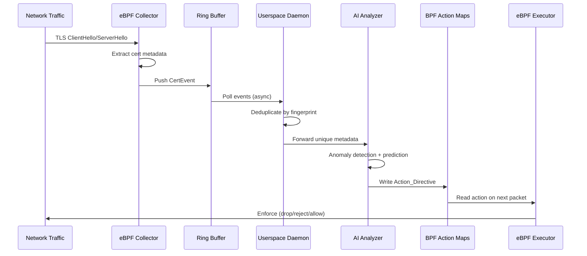

# Design Document: Tlapix Certificate Guardian

## Overview

Tlapix Certificate Guardian is a three-layer autonomous certificate lifecycle management system built in Rust. It uses eBPF (via the [Aya framework](https://aya-rs.dev/)) for zero-overhead TLS handshake observation, an AI-powered userspace analyzer for anomaly detection and renewal prediction, and BPF map-based action execution for kernel-speed autonomous responses.

### Design Goals

- **Zero overhead**: eBPF programs observe TLS handshakes passively without modifying application traffic
- **Safety first**: The kernel never executes dynamically generated code; only pre-verified BPF programs read action maps
- **Solo developer feasibility**: Rust + Aya provides a single-language stack for both kernel and userspace code
- **47-day readiness**: Architecture handles 8x certificate lifecycle volume through autonomous renewal
- **Observability-native**: OpenTelemetry as the primary telemetry backbone with multi-backend export

### Technology Choices

| Layer | Technology | Rationale |
|-------|-----------|-----------|
| eBPF Programs | Rust + Aya (aya-ebpf) | Pure Rust eBPF, no libbpf/BCC dependency, CO-RE support |
| Userspace Daemon | Rust + Tokio | Async runtime, memory safety, single binary deployment |
| AI/ML | ONNX Runtime (ort crate) | Local inference, no external API dependency for core detection |
| ACME Client | instant-acme | Async pure-Rust ACME (RFC 8555) client |
| Observability | opentelemetry-rust + opentelemetry-otlp | Native OTLP export with Prometheus/StatsD bridges |
| Storage | SQLite (rusqlite) | Embedded, zero-config, sufficient for single-node |
| Web UI | axum + htmx | Lightweight, server-rendered, minimal JS |

## Architecture

### High-Level System Diagram

```mermaid
graph TB
    subgraph Kernel Space
        NIC[Network Interface]
        TC[TC Hook / XDP]
        EBPF_COLLECTOR[eBPF Collector Programs]
        RING[BPF Ring Buffer]
        ACTION_MAPS[BPF Action Maps]
        EBPF_EXECUTOR[eBPF Executor Programs]
    end

    subgraph Userspace
        DAEMON[Tlapix Daemon]
        subgraph Collector Service
            RING_READER[Ring Buffer Reader]
            DEDUP[Deduplication Engine]
            META_STORE[Metadata Store]
        end
        subgraph Analyzer Service
            ANOMALY[Anomaly Detector]
            PREDICTOR[Renewal Predictor]
            SHADOW[Shadow Cert Detector]
            INVENTORY[Inventory Manager]
        end
        subgraph Executor Service
            MAP_WRITER[BPF Map Writer]
            ACME[ACME Client]
            WEBHOOK[Webhook Dispatcher]
        end
        subgraph Observability
            OTEL[OpenTelemetry SDK]
            PROM[Prometheus Endpoint]
            STATSD[StatsD Exporter]
            AUDIT[Audit Logger]
        end
        subgraph Optional
            WEB_UI[Built-in Web UI]
        end
    end

    subgraph External
        OTEL_BACKEND[OTLP Backends: Datadog/Dynatrace/Splunk/Grafana]
        CERT_INV[Certificate Inventory Source]
        ACME_CA[ACME CA: Let's Encrypt]
        ALERT_TARGETS[PagerDuty / OpsGenie / Slack]
    end

    NIC --> TC
    TC --> EBPF_COLLECTOR
    EBPF_COLLECTOR --> RING
    RING --> RING_READER
    RING_READER --> DEDUP
    DEDUP --> META_STORE
    META_STORE --> ANOMALY
    META_STORE --> PREDICTOR
    META_STORE --> SHADOW
    SHADOW --> INVENTORY
    INVENTORY --> CERT_INV
    ANOMALY --> MAP_WRITER
    PREDICTOR --> MAP_WRITER
    SHADOW --> MAP_WRITER
    MAP_WRITER --> ACTION_MAPS
    ACTION_MAPS --> EBPF_EXECUTOR
    EBPF_EXECUTOR --> TC
    MAP_WRITER --> ACME
    ACME --> ACME_CA
    MAP_WRITER --> WEBHOOK
    WEBHOOK --> ALERT_TARGETS
    OTEL --> OTEL_BACKEND
    PROM --> OTEL_BACKEND
    AUDIT --> META_STORE
end
```

### Data Flow



## Components and Interfaces

### 1. eBPF Collector (Kernel Space)

**Attachment Points:**
- `tc_ingress` on monitored interfaces for incoming TLS handshakes
- `tc_egress` for outgoing handshakes (server certificate observation)

**Responsibilities:**
- Parse TCP packets to identify TLS record layer (content type 0x16)
- Extract certificate from ServerHello/Certificate messages (TLS 1.2) and EncryptedExtensions (TLS 1.3 — limited to unencrypted portions)
- Compute SHA-256 fingerprint of leaf certificate DER encoding
- Push structured events to BPF ring buffer
- Maintain per-CPU counters for performance metrics

```rust
// eBPF program interface (kernel side)
#[repr(C)]
pub struct TlsCertEvent {
    pub timestamp_ns: u64,
    pub src_ip: u32,          // IPv4, or first 4 bytes of IPv6
    pub dst_ip: u32,
    pub src_port: u16,
    pub dst_port: u16,
    pub ip_version: u8,       // 4 or 6
    pub tls_version: u16,     // 0x0303 = TLS 1.2, 0x0304 = TLS 1.3
    pub sni_len: u16,
    pub sni: [u8; 256],       // SNI hostname from ClientHello
    pub fingerprint: [u8; 32], // SHA-256 of leaf cert DER
    pub cert_len: u32,
    pub cert_data: [u8; 4096], // DER-encoded leaf certificate (truncated)
    pub chain_depth: u8,
    pub issuer_fingerprint: [u8; 32],
    pub is_new: u8,           // 1 if fingerprint not in seen-set
}

// BPF maps used by Collector
// - seen_certs: BPF_MAP_TYPE_HASH (fingerprint -> first_seen_ts)
// - cert_stats: BPF_MAP_TYPE_PERCPU_HASH (fingerprint -> connection_count)
// - drop_counter: BPF_MAP_TYPE_PERCPU_ARRAY (index 0 -> dropped handshakes)
```

**Performance Constraints:**
- eBPF instruction limit: stays within kernel verifier bounds (~1M instructions on 5.2+)
- Ring buffer sized at 16 MB (configurable) to handle burst traffic
- Tail calls used to split parsing logic across multiple programs if needed

### 2. Userspace Collector Service

**Responsibilities:**
- Read events from BPF ring buffer asynchronously (via `aya::maps::RingBuf`)
- Parse DER certificate data into structured metadata using `x509-parser` crate
- Deduplicate by SHA-256 fingerprint with local LRU cache
- Persist metadata to SQLite with last-seen/connection-count updates
- Buffer up to 10,000 records when Analyzer is unavailable
- Reload fingerprint set from persistent storage on restart

```rust
pub trait CollectorService {
    /// Start reading from ring buffer and processing events
    async fn start(&self, cancel: CancellationToken) -> Result<()>;
    
    /// Get current collector statistics
    fn stats(&self) -> CollectorStats;
    
    /// Reload seen-certificate set from persistent storage
    async fn reload_seen_set(&self) -> Result<usize>;
}

pub struct CollectorStats {
    pub total_handshakes_observed: u64,
    pub unique_certificates: u64,
    pub dropped_handshakes: u64,
    pub buffer_utilization: f32, // 0.0 - 1.0
    pub malformed_handshakes: u64,
}
```

### 3. Analyzer Service (Userspace)

**Sub-components:**

#### 3a. Anomaly Detector

```rust
pub trait AnomalyDetector {
    /// Evaluate certificate against anomaly patterns
    async fn evaluate(&self, metadata: &CertificateMetadata) -> Vec<Anomaly>;
    
    /// Check if AI backend is available, fall back to rules if not
    async fn health_check(&self) -> AnalyzerMode;
}

pub enum AnomalyType {
    PolicyViolation { reason: String },      // e.g., validity > 398 days
    WeakCryptography { algorithm: String, key_size: u32 },
    SniMismatch { sni: String, sans: Vec<String> },
    ExpiredCertificate,
    NearExpiry { days_remaining: u32 },
}

pub enum AnalyzerMode {
    AiPowered,
    RuleBasedFallback { reason: String },
}
```

#### 3b. Renewal Predictor

```rust
pub trait RenewalPredictor {
    /// Generate or update renewal prediction for a certificate
    async fn predict(&self, cert: &CertificateMetadata) -> RenewalPrediction;
    
    /// Re-evaluate all active predictions (called every 24h)
    async fn reevaluate_all(&self) -> Vec<RenewalPrediction>;
}

pub struct RenewalPrediction {
    pub cert_fingerprint: [u8; 32],
    pub failure_probability: f64,  // 0.0 - 1.0
    pub days_until_expiry: i32,
    pub severity: Severity,
    pub reasoning: String,
    pub last_evaluated: DateTime<Utc>,
    pub renewal_activity_detected: bool,
}
```

#### 3c. Shadow Certificate Detector

```rust
pub trait ShadowDetector {
    /// Check if certificate exists in inventory
    async fn classify(&self, metadata: &CertificateMetadata) -> ShadowClassification;
    
    /// Escalate risk levels for unresolved shadow certs (called every 24h)
    async fn escalate_stale(&self) -> Vec<ActionDirective>;
}

pub enum ShadowClassification {
    Known,
    Shadow { risk_level: RiskLevel, context: ShadowContext },
    Deferred { reason: String }, // inventory unreachable
}

pub enum RiskLevel {
    Critical, // self-signed or weak key
    High,     // untrusted issuer or long validity
    Medium,   // < 30 days remaining
    Low,      // trusted, adequate strength, normal validity
}
```

#### 3d. Inventory Manager

```rust
pub trait InventoryManager {
    /// Import inventory from configured source
    async fn refresh(&self) -> Result<InventoryRefreshResult>;
    
    /// Check if a fingerprint is in the inventory
    fn contains(&self, fingerprint: &[u8; 32]) -> bool;
    
    /// Get inventory staleness
    fn last_refresh(&self) -> Option<DateTime<Utc>>;
}

pub struct InventoryRefreshResult {
    pub total_entries: usize,
    pub new_entries: usize,
    pub removed_entries: usize,
    pub skipped_invalid: usize,
}
```

### 4. Executor Service (Userspace + Kernel)

**Userspace responsibilities:**
- Write Action_Directives to appropriate BPF maps
- Invoke ACME renewal workflow for "renew" actions
- Dispatch webhook notifications for "alert" actions
- Expire stale directives (>72h without traffic observation)
- Handle map capacity limits and retry logic

**Kernel-side eBPF programs:**
- `protect_program`: Attached to TC, reads protect map, rejects non-pinned certs
- `isolate_program`: Attached to TC, reads isolate map, drops matching connections

```rust
pub trait ExecutorService {
    /// Write an action directive to the appropriate BPF map
    async fn execute(&self, directive: ActionDirective) -> Result<ExecutionOutcome>;
    
    /// Expire directives for certificates not seen in 72h
    async fn expire_stale(&self) -> Vec<ExpiredDirective>;
    
    /// Get current map utilization
    fn map_stats(&self) -> MapStats;
}

pub struct ActionDirective {
    pub id: Uuid,
    pub correlation_id: Uuid,
    pub cert_fingerprint: [u8; 32],
    pub action_type: ActionType,
    pub severity: Severity,
    pub reasoning: String,       // max 500 chars
    pub created_at: DateTime<Utc>,
    pub source_anomaly: Option<AnomalyType>,
    pub attempt_count: u8,
}

pub enum ActionType {
    Alert,
    Renew,
    Protect { pinned_fingerprint: [u8; 32], hostname: String },
    Isolate { target_fingerprint: [u8; 32] },
}

pub enum ExecutionOutcome {
    Success,
    Failed { reason: String, attempts: u8 },
    Expired,
    MapFull,
    Conflict { winner: ActionDirective },
}

// BPF map entry format for kernel-side executor programs
#[repr(C)]
pub struct BpfActionEntry {
    pub fingerprint: [u8; 32],
    pub action: u8,           // 0=alert, 1=renew, 2=protect, 3=isolate
    pub severity: u8,         // 0=low, 1=medium, 2=high, 3=critical
    pub created_ts: u64,      // nanoseconds since epoch
    pub pinned_fp: [u8; 32],  // for protect: the expected cert fingerprint
    pub flags: u8,            // bit 0: active, bit 1: failed
}
```

### 5. Observability Layer

```rust
pub trait ObservabilityExporter {
    /// Initialize all configured export channels
    async fn init(config: &ObservabilityConfig) -> Result<Self>;
    
    /// Record a metric
    fn record_metric(&self, metric: MetricEvent);
    
    /// Write an audit log entry
    async fn audit(&self, entry: AuditEntry) -> Result<()>;
    
    /// Check if audit logging is healthy
    fn audit_healthy(&self) -> bool;
}

pub struct AuditEntry {
    pub correlation_id: Uuid,
    pub cert_fingerprint: [u8; 32],
    pub stage: AuditStage,
    pub timestamp: DateTime<Utc>,
    pub details: serde_json::Value,
}

pub enum AuditStage {
    Observation { src_ip: IpAddr, dst_ip: IpAddr, sni: Option<String> },
    Analysis { anomaly_type: String, confidence: f64 },
    Action { action_type: ActionType, outcome: ExecutionOutcome },
}
```

### 6. Configuration

```rust
pub struct TlapixConfig {
    pub collector: CollectorConfig,
    pub analyzer: AnalyzerConfig,
    pub executor: ExecutorConfig,
    pub observability: ObservabilityConfig,
    pub web_ui: Option<WebUiConfig>,
}

pub struct CollectorConfig {
    pub interfaces: Vec<String>,          // e.g., ["eth0", "lo"]
    pub ring_buffer_size_mb: u32,         // default: 16
    pub local_buffer_capacity: usize,     // default: 10_000
    pub metadata_retention_days: u32,     // default: 90
}

pub struct AnalyzerConfig {
    pub ai_model_path: PathBuf,           // ONNX model file
    pub ai_timeout_secs: u64,            // default: 5
    pub inventory_source: InventorySource,
    pub inventory_poll_interval_secs: u64, // default: 300 (5 min)
    pub prediction_reevaluation_hours: u64, // default: 24
    pub renewal_threshold_probability: f64, // default: 0.7
}

pub enum InventorySource {
    File { path: PathBuf },
    Api { endpoint: String, auth_token: String },
}

pub struct ExecutorConfig {
    pub max_map_entries: u32,             // default: 10_000
    pub max_map_memory_mb: u32,          // default: 64
    pub acme_config: Option<AcmeConfig>,
    pub webhooks: Vec<WebhookConfig>,
    pub directive_expiry_hours: u64,      // default: 72
    pub retry_max_attempts: u8,          // default: 3
    pub retry_base_ms: u64,             // default: 100
}

pub struct ObservabilityConfig {
    pub otlp_endpoint: Option<String>,
    pub otlp_auth_token: Option<String>,
    pub otlp_export_interval_secs: u64,  // default: 60
    pub prometheus_bind: Option<SocketAddr>,
    pub statsd_endpoint: Option<String>,
    pub audit_retention_days: u32,       // default: 90
}

pub struct WebhookConfig {
    pub endpoint: String,
    pub timeout_secs: u64,               // default: 10
    pub retry_max: u8,                   // default: 3
    pub retry_base_secs: u64,           // default: 1
}
```

## Data Models

### Certificate Metadata (SQLite Schema)

```sql
CREATE TABLE certificates (
    fingerprint BLOB(32) PRIMARY KEY,     -- SHA-256
    subject TEXT NOT NULL,                  -- up to 2048 chars
    issuer TEXT NOT NULL,                   -- up to 2048 chars
    serial_number TEXT NOT NULL,
    not_before INTEGER NOT NULL,           -- Unix timestamp
    not_after INTEGER NOT NULL,            -- Unix timestamp
    sans TEXT,                             -- JSON array, up to 100 entries
    key_algorithm TEXT NOT NULL,
    key_size INTEGER NOT NULL,
    chain_depth INTEGER DEFAULT 1,
    issuer_fingerprint BLOB(32),
    first_seen INTEGER NOT NULL,           -- Unix timestamp ms
    last_seen INTEGER NOT NULL,            -- Unix timestamp ms
    connection_count INTEGER DEFAULT 1,
    source_ip TEXT,
    destination_ip TEXT,
    sni_hostname TEXT,
    completeness_flags INTEGER DEFAULT 0,  -- bitmask for field presence
    created_at INTEGER NOT NULL,
    updated_at INTEGER NOT NULL
);

CREATE INDEX idx_cert_not_after ON certificates(not_after);
CREATE INDEX idx_cert_last_seen ON certificates(last_seen);
CREATE INDEX idx_cert_issuer_fp ON certificates(issuer_fingerprint);
```

### Action Directives (SQLite Schema)

```sql
CREATE TABLE action_directives (
    id TEXT PRIMARY KEY,                   -- UUID
    correlation_id TEXT NOT NULL,          -- UUID for end-to-end tracing
    cert_fingerprint BLOB(32) NOT NULL,
    action_type TEXT NOT NULL,             -- alert|renew|protect|isolate
    severity TEXT NOT NULL,                -- low|medium|high|critical
    reasoning TEXT,                        -- max 500 chars
    status TEXT NOT NULL DEFAULT 'pending', -- pending|active|executed|failed|expired
    attempt_count INTEGER DEFAULT 0,
    created_at INTEGER NOT NULL,
    executed_at INTEGER,
    expired_at INTEGER,
    failure_reason TEXT,
    FOREIGN KEY (cert_fingerprint) REFERENCES certificates(fingerprint)
);

CREATE INDEX idx_directive_status ON action_directives(status);
CREATE INDEX idx_directive_cert ON action_directives(cert_fingerprint);
CREATE INDEX idx_directive_correlation ON action_directives(correlation_id);
```

### Shadow Certificates (SQLite Schema)

```sql
CREATE TABLE shadow_certificates (
    fingerprint BLOB(32) PRIMARY KEY,
    risk_level TEXT NOT NULL,              -- critical|high|medium|low
    first_classified INTEGER NOT NULL,     -- Unix timestamp
    last_escalated INTEGER,
    escalation_count INTEGER DEFAULT 0,
    source_ip TEXT,
    destination_ip TEXT,
    first_seen INTEGER NOT NULL,
    is_resolved INTEGER DEFAULT 0,
    resolved_at INTEGER,
    FOREIGN KEY (fingerprint) REFERENCES certificates(fingerprint)
);
```

### Renewal Predictions (SQLite Schema)

```sql
CREATE TABLE renewal_predictions (
    cert_fingerprint BLOB(32) PRIMARY KEY,
    failure_probability REAL NOT NULL,     -- 0.0 to 1.0
    severity TEXT NOT NULL,
    days_until_expiry INTEGER NOT NULL,
    renewal_activity_detected INTEGER DEFAULT 0,
    reasoning TEXT,
    last_evaluated INTEGER NOT NULL,
    created_at INTEGER NOT NULL,
    FOREIGN KEY (cert_fingerprint) REFERENCES certificates(fingerprint)
);
```

### Audit Log (SQLite Schema)

```sql
CREATE TABLE audit_log (
    id INTEGER PRIMARY KEY AUTOINCREMENT,
    correlation_id TEXT NOT NULL,
    cert_fingerprint BLOB(32) NOT NULL,
    stage TEXT NOT NULL,                   -- observation|analysis|action
    timestamp INTEGER NOT NULL,
    details TEXT NOT NULL,                 -- JSON
    created_at INTEGER NOT NULL
);

CREATE INDEX idx_audit_correlation ON audit_log(correlation_id);
CREATE INDEX idx_audit_timestamp ON audit_log(timestamp);
CREATE INDEX idx_audit_cert ON audit_log(cert_fingerprint);
```

### Certificate Inventory (SQLite Schema)

```sql
CREATE TABLE certificate_inventory (
    fingerprint BLOB(32) PRIMARY KEY,
    subject TEXT NOT NULL,
    source TEXT NOT NULL,                  -- file|api
    imported_at INTEGER NOT NULL,
    last_refresh_id TEXT NOT NULL          -- tracks which refresh cycle added this
);

CREATE TABLE inventory_refresh_log (
    id TEXT PRIMARY KEY,                   -- UUID
    timestamp INTEGER NOT NULL,
    source TEXT NOT NULL,
    total_entries INTEGER,
    new_entries INTEGER,
    removed_entries INTEGER,
    skipped_invalid INTEGER,
    success INTEGER NOT NULL              -- 0 or 1
);
```

### BPF Map Layouts

| Map Name | Type | Key | Value | Max Entries |
|----------|------|-----|-------|-------------|
| `seen_certs` | HASH | `[u8; 32]` (fingerprint) | `u64` (first_seen_ns) | 100,000 |
| `cert_stats` | PERCPU_HASH | `[u8; 32]` (fingerprint) | `u64` (conn_count) | 100,000 |
| `action_alert` | HASH | `[u8; 32]` (fingerprint) | `BpfActionEntry` | 10,000 |
| `action_protect` | HASH | `[u8; 32]` (fingerprint) | `BpfActionEntry` | 10,000 |
| `action_isolate` | HASH | `[u8; 32]` (fingerprint) | `BpfActionEntry` | 10,000 |
| `drop_counter` | PERCPU_ARRAY | `u32` (index) | `u64` (count) | 4 |
| `events` | RINGBUF | — | `TlsCertEvent` | 16 MB |


## Correctness Properties

*A property is a characteristic or behavior that should hold true across all valid executions of a system — essentially, a formal statement about what the system should do. Properties serve as the bridge between human-readable specifications and machine-verifiable correctness guarantees.*

### Property 1: TLS Handshake Parsing Round-Trip

*For any* valid DER-encoded X.509 certificate embedded in a TLS 1.2 or TLS 1.3 handshake byte sequence, the Collector's parser SHALL extract Certificate_Metadata where the SHA-256 fingerprint matches the fingerprint computed directly from the original DER bytes, and all required fields (subject, issuer, serial_number, not_before, not_after, key_algorithm, key_size) are present and match the certificate's ASN.1 content.

**Validates: Requirements 1.1, 1.2, 2.1**

### Property 2: Malformed Input Resilience

*For any* arbitrary byte sequence that is not a valid TLS handshake, the Collector's parser SHALL return an error result without panicking, and the system SHALL continue processing subsequent inputs without state corruption.

**Validates: Requirements 1.5**

### Property 3: Deduplication and Observation Counting

*For any* sequence of N certificate observation events containing K unique fingerprints, the Collector SHALL forward exactly K metadata records to the Analyzer, and for each unique fingerprint observed M times, the stored connection_count SHALL equal M and last_seen SHALL equal the timestamp of the most recent observation.

**Validates: Requirements 2.2, 2.3**

### Property 4: Buffer Capacity Invariant

*For any* sequence of metadata records arriving while the Analyzer is unavailable, the Collector's local buffer SHALL never exceed 10,000 entries, and when the buffer is full, the oldest records SHALL be discarded first (FIFO eviction).

**Validates: Requirements 1.7**

### Property 5: Fingerprint Persistence Round-Trip

*For any* set of certificate fingerprints persisted to storage, reloading the fingerprint set SHALL produce a set equal to the original, ensuring previously-seen certificates are not re-reported as new after restart.

**Validates: Requirements 1.8**

### Property 6: Partial Metadata Completeness Flags

*For any* certificate with a subset of extractable fields, the completeness_flags bitmask SHALL have bit N set if and only if field N is present in the extracted metadata, and the Analyzer SHALL evaluate only anomaly patterns applicable to present fields.

**Validates: Requirements 2.4, 3.7**

### Property 7: Anomaly Detection Rule Correctness

*For any* certificate with known attributes (validity_days, key_algorithm, key_size, SNI, SANs), the Analyzer SHALL detect an anomaly if and only if at least one rule is violated: validity > 398 days → PolicyViolation/medium, RSA < 2048 or ECDSA < 256 → WeakCryptography/critical, SNI not matching any SAN (exact or wildcard) → SniMismatch/high. The number of Action_Directives generated SHALL equal the number of distinct anomalies detected.

**Validates: Requirements 3.2, 3.3, 3.4, 3.5**

### Property 8: SNI-to-SAN Wildcard Matching

*For any* SNI hostname and SAN list, a match exists if and only if at least one SAN either equals the SNI (case-insensitive) or is a wildcard SAN (starting with "*.") whose base domain matches the SNI's parent domain with exactly one subdomain level.

**Validates: Requirements 3.4**

### Property 9: Renewal Prediction Correctness

*For any* certificate observed in traffic with days_until_expiry ≤ 30, the Analyzer SHALL generate a Renewal_Prediction with: failure_probability ≥ 0.5 when no historical data exists, severity = critical when days_until_expiry < 14 AND no renewal activity detected, and an Action_Directive of type "renew" when failure_probability ≥ 0.7.

**Validates: Requirements 4.1, 4.2, 4.3, 4.5**

### Property 10: Shadow Certificate Classification

*For any* certificate observed in traffic, if its SHA-256 fingerprint is not present in the Certificate_Inventory, the Analyzer SHALL classify it as a Shadow_Certificate with risk_level determined by: critical if self-signed OR weak key, high if untrusted issuer OR validity > 398 days, medium if < 30 days remaining, low otherwise. An Action_Directive of type "alert" with origin context (source_ip, destination, first_seen) SHALL be generated.

**Validates: Requirements 5.2, 5.3, 5.4**

### Property 11: Shadow Certificate Escalation

*For any* Shadow_Certificate observed within the preceding 24-hour window that remains unregistered in the Certificate_Inventory, the risk_level SHALL escalate by one tier per 24-hour period (low → medium → high → critical), and upon reaching critical, a new Action_Directive at critical severity SHALL replace any prior lower-severity directive for that certificate.

**Validates: Requirements 5.5, 5.7**

### Property 12: Inventory Reconciliation

*For any* certificate previously classified as Shadow that subsequently appears in an updated Certificate_Inventory, the Analyzer SHALL reclassify it as known and cancel all pending Action_Directives for it. Conversely, for any certificate previously in the inventory that is absent from a full refresh while still observed in traffic, the Analyzer SHALL reclassify it as Shadow.

**Validates: Requirements 9.3, 9.6**

### Property 13: Inventory Import Robustness

*For any* inventory data containing a mix of valid entries (with fingerprint and subject) and invalid entries (missing required fields), the import SHALL accept all valid entries and skip all invalid entries, with the count of skipped entries logged.

**Validates: Requirements 9.5**

### Property 14: Directive Expiry

*For any* Action_Directive referencing a certificate whose last_seen timestamp is more than 72 hours in the past, the Executor SHALL expire the directive and remove it from the BPF_Map.

**Validates: Requirements 6.5**

### Property 15: Directive Conflict Resolution

*For any* pair of Action_Directives targeting the same certificate (by SHA-256 fingerprint), the Executor SHALL apply only the directive with the highest severity and discard the lower-severity directive.

**Validates: Requirements 6.9**

### Property 16: BPF Map Capacity Enforcement

*For any* sequence of BPF_Map write operations, the Executor SHALL enforce a maximum of 10,000 entries per map. When a map reaches capacity, new writes SHALL be rejected and the Analyzer SHALL be notified.

**Validates: Requirements 7.3, 7.8**

### Property 17: Program Integrity Validation

*For any* set of pre-loaded eBPF program binaries with expected SHA-256 checksums, the startup validator SHALL pass if and only if every program's computed checksum matches its expected checksum. A single mismatch SHALL abort startup.

**Validates: Requirements 7.6, 7.7**

### Property 18: Retry Exhaustion State Transition

*For any* Action_Directive that fails execution 3 consecutive times, the Executor SHALL mark it as failed, log the failure reason, and generate an alert notification to operators.

**Validates: Requirements 6.7**

### Property 19: Audit Trail Completeness

*For any* certificate observation event, the system SHALL assign a unique correlation_id that appears in all downstream audit entries (observation → analysis → action). For high-impact actions (isolate, protect, renew), the audit event SHALL contain the complete decision chain: observation context (fingerprint, first_seen), analysis context (anomaly_type, confidence), and action context (action_type, outcome, timestamp).

**Validates: Requirements 8.1, 8.2, 8.4, 8.7**

### Property 20: Data Retention Policy

*For any* stored Certificate_Metadata with last_seen older than 90 days, the record SHALL be eligible for deletion. For any audit log entry younger than 90 days, the record SHALL NOT be deleted.

**Validates: Requirements 2.6, 8.5**

### Property 21: Export Format Compliance

*For any* metric event or action execution, the exported payload (webhook JSON, OTLP annotation, Prometheus text, StatsD message) SHALL contain: correlation_id, cert_fingerprint, action_type, severity, and timestamp. Multiple export targets SHALL operate independently such that failure of one does not affect delivery to others.

**Validates: Requirements 10.3, 10.4, 10.9, 10.10**

### Property 22: Certificate Chain Extraction

*For any* TLS handshake presenting a certificate chain of depth D (where D ≥ 1), the Collector SHALL extract the leaf certificate metadata and record chain_depth = D and issuer_fingerprint matching the SHA-256 of the immediate issuing CA certificate.

**Validates: Requirements 2.7**

## Error Handling

### Collector Layer Errors

| Error Condition | Handling Strategy | Recovery |
|----------------|-------------------|----------|
| Malformed TLS handshake | Log event with context (timestamp, IPs, port, available bytes), skip packet | Continue processing next packet |
| Ring buffer full | Increment drop_counter, skip event | Automatic (consumer catches up) |
| Analyzer unreachable | Buffer locally (up to 10,000 records), retry with exponential backoff | Auto-retry at 30s intervals for up to 1 hour |
| Persistent storage failure | Log error, operate with in-memory fingerprint set | Retry storage on next write cycle |
| Certificate too large for buffer | Truncate at 4096 bytes, set partial flag | Store partial metadata |

### Analyzer Layer Errors

| Error Condition | Handling Strategy | Recovery |
|----------------|-------------------|----------|
| AI model backend timeout (>5s) | Fall back to rule-based detection, log degraded state | Retry AI connection on next evaluation cycle |
| Inventory source unreachable (>30s) | Continue with last known inventory, log failure | Retry on next poll cycle |
| Inventory stale (>60 min) | Log staleness warning, include age in classifications | Continue polling |
| Malformed inventory entries | Skip invalid entries, log each, continue with valid | No recovery needed |
| BPF map write failure | Retry up to 3 times with exponential backoff (100ms base) | After 3 failures: log, notify, discard |

### Executor Layer Errors

| Error Condition | Handling Strategy | Recovery |
|----------------|-------------------|----------|
| BPF map write failure | Retry 3x with exponential backoff (100ms, 200ms, 400ms) | After exhaustion: mark failed, alert operators |
| Map at capacity | Reject write, log capacity event, notify Analyzer | Automatic (directives expire after 72h) |
| ACME renewal failure | Retry within 30s window, escalate on failure | Generate critical alert for manual intervention |
| Webhook delivery failure | Retry 3x with exponential backoff (1s, 2s, 4s) | After exhaustion: log failure, increment metric |
| Checksum validation failure | Abort startup, log mismatch details | Requires operator intervention |
| Audit logging failure | **Halt all directive processing** until restored | Expose metric, wait for storage recovery |

### Safety Invariants

1. **No dynamic BPF code**: The system NEVER generates, compiles, or loads eBPF bytecode after initialization
2. **Bounded memory**: BPF maps are capped at 10,000 entries / 64 MB total
3. **Audit-before-action**: If audit logging fails, no new actions are executed
4. **Graceful degradation**: AI failure → rule-based fallback; inventory failure → last-known state
5. **Kernel verifier**: All eBPF programs must pass kernel verifier at load time

## Testing Strategy

### Property-Based Testing

**Library**: [proptest](https://crates.io/crates/proptest) (Rust)

**Configuration**: Minimum 100 iterations per property test (configurable via `PROPTEST_CASES` env var).

Each property test is tagged with a comment referencing the design property:
```rust
// Feature: tlapix-certificate-guardian, Property 1: TLS Handshake Parsing Round-Trip
```

**Property tests cover:**
- Certificate parsing correctness (Properties 1, 6, 22)
- Malformed input resilience (Property 2)
- Deduplication and counting invariants (Property 3)
- Buffer capacity invariants (Property 4)
- Persistence round-trip (Property 5)
- Anomaly detection rules (Properties 7, 8)
- Renewal prediction logic (Property 9)
- Shadow certificate classification and escalation (Properties 10, 11)
- Inventory reconciliation (Properties 12, 13)
- Directive lifecycle (Properties 14, 15, 16, 18)
- Program integrity validation (Property 17)
- Audit trail completeness (Property 19)
- Data retention (Property 20)
- Export format compliance (Property 21)

**Generators needed:**
- `arb_x509_certificate()`: Generates random valid DER-encoded X.509 certificates with configurable attributes
- `arb_tls_handshake(version)`: Wraps a certificate in a valid TLS 1.2 or 1.3 handshake byte sequence
- `arb_malformed_bytes()`: Generates random byte sequences that are NOT valid TLS
- `arb_certificate_metadata()`: Generates random CertificateMetadata structs
- `arb_action_directive()`: Generates random ActionDirective structs
- `arb_inventory()`: Generates random inventory datasets with configurable valid/invalid ratio
- `arb_fingerprint()`: Generates random 32-byte SHA-256 fingerprints
- `arb_san_list()`: Generates random SAN lists including wildcards
- `arb_sni_hostname()`: Generates random hostnames for SNI matching tests

### Unit Tests (Example-Based)

- AI backend timeout and fallback behavior (Req 3.6)
- Inventory source timeout handling (Req 9.4)
- Inventory staleness warning at 60 minutes (Req 9.7)
- BPF map write retry with exact backoff timing (Req 7.4, 7.5)
- Webhook retry with exact backoff timing (Req 10.6, 10.7)
- Checksum validation failure aborts startup (Req 7.7)
- Audit logging failure halts processing (Req 8.6)
- All four action types execute correctly (Req 6.2)
- Standalone web UI serves expected pages (Req 10.8)

### Integration Tests

- End-to-end pipeline: synthetic TLS traffic → observation → analysis → action (Reqs 1.1, 3.1, 6.1)
- Performance: 10,000 handshakes/sec with <1% CPU overhead (Req 1.3)
- Drop rate under overload: <0.1% (Req 1.6)
- eBPF enforce latency: protect/isolate within 100ms (Reqs 6.3, 6.8)
- ACME renewal workflow invocation (Req 6.6)
- OTLP export to mock collector (Reqs 10.1, 10.2)
- Webhook delivery timing (Req 10.5)
- Metric update latency <60s (Req 8.3)
- Inventory polling and refresh within 5 minutes (Req 9.2)

### Smoke Tests

- All eBPF programs pass kernel verifier (Reqs 7.1, 7.9)
- No BPF program loading after initialization (Req 7.2)
- System startup with valid checksums (Req 7.6)
- BPF map creation with correct types and sizes (Req 6.4)

### Test Environment

- **Kernel**: Linux 5.15+ (for BPF ring buffer and modern map types)
- **CI**: Use `veth` pairs with synthetic TLS traffic for eBPF integration tests
- **Mocks**: AI model backend, ACME CA, webhook endpoints, inventory sources
- **Fixtures**: Pre-generated X.509 certificates with known attributes for deterministic tests
